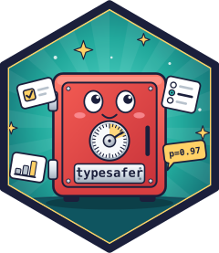

<!-- README.md is generated from README.qmd. Edit README.qmd, then run
     `quarto render README.qmd` (needs TYPESAFE_API_KEY: the examples call the
     live API). -->

# typesafer <a href="https://github.com/parmsam/typesafer"></a>

<!-- badges: start -->

[](https://lifecycle.r-lib.org/articles/stages.html#experimental)
[](https://github.com/parmsam/typesafer/actions/workflows/R-CMD-check.yaml)
<!-- badges: end -->

> This package is experimental. To learn how Jev and the System One API work
> (state, question types, confidence, and patterns), read the official
> [TypeSafe docs](https://docs.typesafe.ai/).

typesafer brings TypeSafe’s typed, calibrated decisions to R.

It’s an **unofficial** client for the
[TypeSafe System One API](https://docs.typesafe.ai/api). You send a piece of
state (text or structured data) and a set of typed questions, and get back
calibrated probabilities your code can act on:

- `ts_noul()`: yes/no questions. The answer is the probability of yes.
- `ts_choice()`: pick one of up to 255 options. The answer is the chosen
  option, a probability for every option, and a confidence.
- `ts_score()`: rate against 2 to 10 ordered levels. The answer is the
  probability-weighted level, a probability for every level, and a
  confidence.

typesafer isn’t affiliated with or endorsed by TypeSafe.

## Installation

Install the development version from GitHub:

``` r
# install.packages("pak")
pak::pak("parmsam/typesafer")
```

## Authentication

Get an API key from TypeSafe and set it in the `TYPESAFE_API_KEY` environment
variable, for example by adding this line to your `.Renviron`
(`usethis::edit_r_environ()`):

    TYPESAFE_API_KEY=your-key-here

## Quickstart

Ask several questions about one piece of state in a single request:

``` r
library(typesafer)

resp <- system_one(
  "I was charged twice. Please help ASAP.",
  billing = ts_noul("Is this about billing?"),
  tone    = ts_choice("What is the tone?", c("calm", "angry")),
  urgency = ts_score("How urgent is this?", c("low", "medium", "high"))
)

resp@answers$billing@prob
#> [1] 0.98
resp@answers$tone@choice
#> [1] "angry"
resp@answers$urgency@score
#> [1] 1.9
```

Printing the response gives a one-line summary per answer:

``` r
resp
#> <ts_response> jev-1.13.0 | 346 input / 65 output tokens
#>   billing noul   0.98
#>   tone    choice "angry"    (confidence 0.97)
#>   urgency score  1.90 [0-2] (confidence 0.85)
```

Scores use the API’s 0-based scale. With levels `c("low", "medium", "high")`, a
score near 2 means `"high"`. The full distribution is ordered by level. The API
rounds the probabilities it reports, so they may not reproduce `score` exactly:

``` r
resp@answers$urgency@probabilities
#> [1] 0.0 0.1 0.9
```

Choice options can carry descriptions, and instructions, options, and levels
can all be structured lists:

``` r
ts_choice(
  "Which team should handle this?",
  c(
    billing   = "Payments, invoicing, refunds",
    technical = "Bugs, outages, integrations",
    sales     = "Pricing, upgrades, new accounts"
  )
)
#> <ts_choice> Which team should handle this?
#>   billing:   Payments, invoicing, refunds
#>   technical: Bugs, outages, integrations
#>   sales:     Pricing, upgrades, new accounts

ts_noul(
  "Does this convey urgency?",
  c(true = "Explicitly time-sensitive", false = "No urgency expressed")
)
#> <ts_noul> Does this convey urgency?
#>   true:  Explicitly time-sensitive
#>   false: No urgency expressed
```

## Data frames

`system_one_df()` sends one request per row, with every question batched into
that request, and runs the requests in parallel. It returns the input as a
tibble with answer columns added:

``` r
tickets <- tibble::tibble(
  id = 1:3,
  text = c(
    "Please cancel my subscription and refund this month.",
    "How do I export my data to CSV?",
    "Your app crashed and I lost an hour of work!!"
  )
)

system_one_df(
  tickets,
  state = text,
  billing = ts_noul("Is this about billing?"),
  tone    = ts_choice("What is the tone?", c("calm", "angry")),
  urgency = ts_score("How urgent is this?", c("low", "medium", "high"))
)
#> # A tibble: 3 × 7
#>      id text                      billing tone  tone_confidence urgency urgency_confidence
#>   <int> <chr>                       <dbl> <chr>           <dbl>   <dbl>              <dbl>
#> 1     1 Please cancel my subscri…    0.97 calm             0.95    1.16               0.54
#> 2     2 How do I export my data …    0.05 calm             1       0.1                0.84
#> 3     3 Your app crashed and I l…    0.05 angry            1       1.83               0.74
```

Set `probs = TRUE` to also get each choice and score probability distribution
as a list-column. Use `on_error = "continue"` to keep the rows that succeeded
when some requests fail. Failed rows get `NA` answers and their errors go in an
`.error` column.

## Errors and retries

Requests that are rate limited (429), hit an overloaded server (529) or another
5xx, time out (408), or fail to connect are retried twice with exponential
backoff. `retry-after` headers are respected. Errors are classed conditions
that inherit from `typesafer_error`:

| Class                        | When                                     |
|------------------------------|------------------------------------------|
| `typesafer_error_auth`       | Missing API key, or HTTP 401             |
| `typesafer_error_validation` | HTTP 422; `err$details` lists the fields |
| `typesafer_error_rate_limit` | HTTP 429 or 529 after retries            |
| `typesafer_error_server`     | Other HTTP 5xx after retries             |
| `typesafer_error_http`       | Any unsuccessful HTTP response           |
| `typesafer_error_connection` | No response after retries                |
| `typesafer_error_input`      | Invalid arguments, before any request    |

Invalid questions are caught before anything is sent:

``` r
ts_score("How urgent is this?", "high")
#> Error in `ts_score()`:
#> ! `criteria` must have between 2 and 10 levels, not 1.
```

API errors carry the server’s message and request ID:

``` r
system_one("Hi", q = ts_noul("Is this a greeting?"), api_key = "not-a-real-key")
#> Error in `system_one()`:
#> ! TypeSafe API rejected the API key (HTTP 401).
#> ✖ Cannot authenticate with the server. Please check your API key and try again.
#> ℹ Check the key passed to `api_key`.
#> ℹ Request ID: req_01a0fe0a634e74d391b9c51101629d32
```

Catch them by class:

``` r
tryCatch(
  system_one("Hi", q = ts_noul("Is this a greeting?"), model = "no-such-model"),
  typesafer_error_rate_limit = function(err) NULL,
  typesafer_error_http = function(err) err$status
)
#> [1] 400
```

## Models

`ts_models()` lists the models your account can use:

``` r
ts_models()
#> # A tibble: 2 × 3
#>   name        description                                                      release_date
#>   <chr>       <chr>                                                            <date>      
#> 1 jev-latest  The latest iteration of TypeSafe's System One Model: Jev         2026-09-10  
#> 2 jev-preview A preview version of `jev-latest`: should be better in most ways 2026-09-10
```

`jev-latest` is the default. Pin a versioned ID such as `jev-1.13.0` if you
have tuned thresholds against a specific release.

## Development

``` r
devtools::test()   # uses recorded mocks; no API key needed
devtools::check()
```

`tests/testthat/test-live.R` also runs a few tests against the live API when
`TYPESAFE_API_KEY` is set. They’re skipped on CRAN and CI.

This README is generated from `README.qmd`. Edit that file, then run
`quarto render README.qmd` with `TYPESAFE_API_KEY` set, because the examples
call the live API.

See [AGENTS.md](AGENTS.md) for the package layout, conventions, JSON
serialization gotchas, and how the test fixtures are generated.

## Acknowledgements

- The [TypeSafe Python SDK](https://github.com/typesafe-ai/typesafe-sdk-python/tree/main)
  is the reference implementation. typesafer follows its request shapes, retry
  policy, and error handling wherever the
  [API docs](https://docs.typesafe.ai) leave a behavior unspecified.
- [ellmer](https://github.com/tidyverse/ellmer) inspired the design. Typed
  questions and answers are S7 classes, requests go through httr2, and
  `system_one_df()` is modeled on `parallel_chat_structured()`.

## License

MIT © Sam Parmar. See [LICENSE.md](LICENSE.md).
